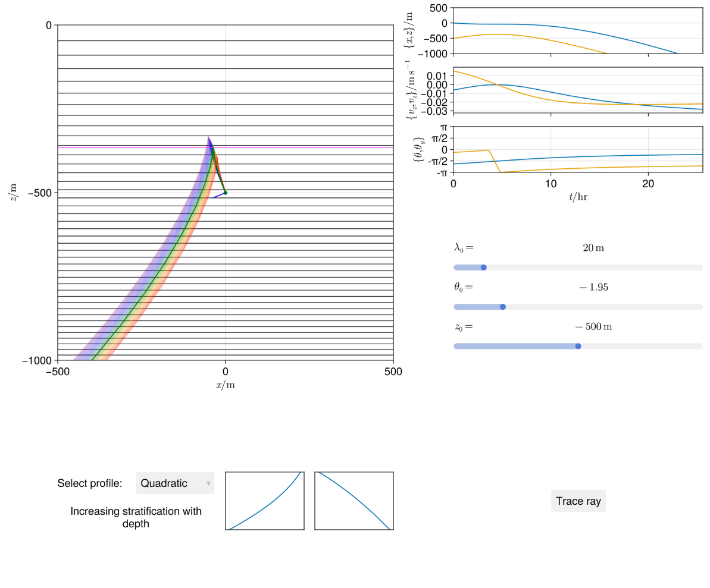

# ig-wave-vis: A Julia setup for visualising internal gravity wave rays

Exercise for the CREATE QCS training module Perturbation Theory in Fluid Mechanics.

Ray solutions to 
```math
\nabla^2 \frac{\partial^2 \phi}{\partial t^2} + N^2(z)\frac{\partial^2 \phi}{\partial x^2} = 0
```

In this folder, do `julia --project="env"` then `include("src/run.jl")` to open the following GLMakie window:



The background buoyancy $b = \int N\text{d}z$ is shown as a contour plot. The profile can be chosen with the drop-down menu.

The initial wavevector and phase velocity direction is blue, and the group velocity is green. The initial conditions (wavelength, angle and depth) can be controlled with the sliders on the right side. The critical layer (where $N^2 = \omega^2$) is shown as a magenta contour.

A green line shows the path of the ray, while a rainbow shows the paths of rays that start at $\pm 0.1$ radians of the initial angle.

Line plots show position, group velocity and angle of the wavevector and group velocity over time.
